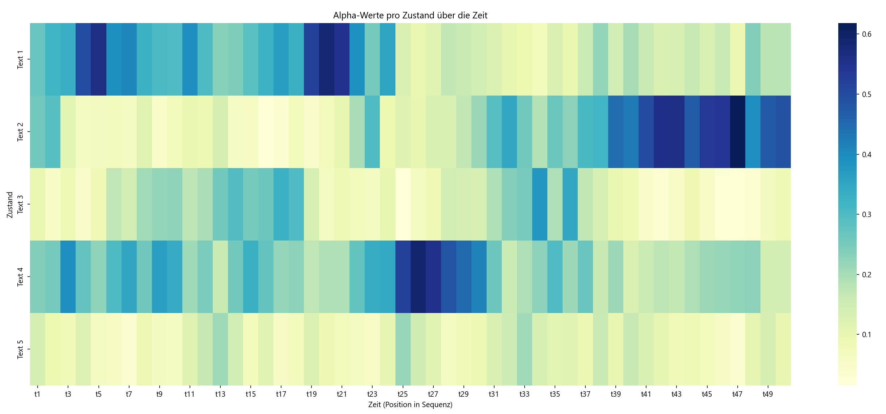

Der Vorwärts-Algorithmus
========================

In diesem Praktikum implementieren Sie den Vorwärts-Algorithmus am Beispiel
von überlieferten Texten einer fiktiven uralten Zivilisation.

Archäologie - Das Setting
-------------------------

Bei einer Ausgrabung finden Sie fünf Texte einer uralten Zivilisation. 
Diese Texte lauten wir folgt

**Erster Text**:

.. code-block:: bash

  🧁🧯  🤇🥌🦟  🤇🤫🥌😼🤫  🤇🤟  🦘🦊🥾
  🤯🤯🧛😎😼  🥌🥦🤇🤇🦟😒  🧁🧛🧁🦊🧯  🦘😎🦘🦟🤯🦺  🥾🥾🥑🥑🥌
  🤟🧁🥦  🥦😼🦊🥾🦺🤇  🧯🦟🦘🤶🦺🦟🥷🧯  😎🦟🦊🤟
  🧁😎🦺🦊🤫🥌🧯  🦺😎  🦘😼🥦😎🥑  🤯🦘🦘🦺🦺  😼🤟🥾🤯🥾🤶🥦🦘
  🦟😎🤟🦺😼🤶🤟  🧁🦟😎🤯🧛🤇🤟  🧯🤟  😎🦘🥌🧁🦘🤶🦺🦊  🤶🤶🤫🤟🦺
  🤇🥌😎🥌🤟🤇  🥦🦺🦘🤇🥾🥷  🤯🦘🦺😒  🧯🦟🦊  🤇🧯🥌  🦟🤇🧛🧛🤟🤯🧛
  🤫🦟  🥦🤶🥑🤇🥑  🥦🦊🥦  😼🤇🦟😎🥑  🧁🦊🤯🤫🦘🥾🦊
  😎😼  🧛😎🧛🦊🤇🦊🦺🥷  🤯🦘🤶🧁🧁🧁🥌  🥷🤶🦊🦊😒🧛  😼😎🤫🧁

**Zweiter Text**:

.. code-block:: bash

  🦺🤶🦺🦟  🦘🧯  🧛🥑🤯  🤶🥌🤇🥷😒
  🧁🦘🥾  😎🤯  🤫🧁🤟🦺🤟🧯  🦺🤟🦟🤫😼
  🤶😒🦺🥾  🧁🤶🥷🧛🧛🤫🧛  🤇🥾🤫🤇😒🦟🦟  🤇🥦🥷🧁🥑
  😎🧯🦘🦟  🧛🦟🤇🧛🤫  😼🤟🦘  😎🦟🤯
  🥷🤯🤟🧯🧁  🧁🤶🧁🧛🦘  🧁🤶🧯🥑🤯😒  🥦🥾🤶🤫😎  😎😎🤯😼🤶🧁🥷🦟
  🧛😼🤟  🥑🤇🥾  🥾😒🤫  🧁😎🧛🤟🦺🥑🤯🤇  🦟🧯🥷  🥾🤇🥾
  🥦🧁🦊😎🧁😒  😎🤇😼🤯🦊🥾🥷  😎🥌🤯🦟🧛🧁🧛  🦘🧁  😎😒🦊🧛  🥾🥾🤶🤯
  😎😒🧛🤯🧁  🤟🦺🤯🧛  🦊🤶🥾🥑🥷🦘🦺  🦟😼🦘  🦘🤶😼🤫  🦟🦘😼🤯🤯

**Dritter Text**:

.. code-block:: bash

  🧯🧛🦟🤫🥦🤇🦟  😎🥑🤟🥷🧯🤫🤫  🥷🧯🦺🦺  🧛🥑🥾🦺🧁
  🤇🦟🧁🥌🤇🥾🤶🥑  🥾🤫  😼🥑🦺  🤶🦺🦟  🤫🦺  🥦😼🧯🤫🦺🤶
  🤟🥾🦺🤇  🤯🥦🤫🦟🤯🤟🤟🤶  🧛🥦🧁  🦘🧯🥾🧛🧯  🥑🤶😼
  😎😎🥾🧛🧛  🦘🥑🧁😼🥌🤫🤟  🤟🤇🤶🦊🥾  🤫😼🤫🥾🦟🧁  🤇🦘🦺🧛😼  🥾🤇🥌🧁🤫🥷🦟🤫
  🥑🧁🧁🤫🥑🦟🤟🥑  🧛🥌🥾  😼😼🤶🤟🦘  🤟🦺🤇🦘🧛🤯🥌  🧁🦟🤯🥾
  🦘🥑  😼🥦🦟🧛🥑🧯🥌  🤇😼  😼🤫
  🥾🦊🥷  🦘🤟  🦊🥑🤯🤫🥌🧛  🤇🤫😎🦺🥌  🥾🥦🥑🦊🧁  🥌😼😎🤫🤯
  🥦🤶🧛🤟😒🦟🧁🧯  🤇🤫🧛🥦🦺🤟  🥦🤶🥑🦟  🦺🧛🦘🥦🧯🦺

**Vierter Text**:

.. code-block:: bash

  😎🧁🥦🦊🦟🥦  🤶🧯🥌🧯🤟  🧯🦺🧯😒🧁🧛  🦊🧁🥑🤫🤶  🤶🧁🦺🦊😎🤫🧛🥷  😒🤇🥌🤯🤇🤶🤶🥾
  🦊😼🦟🦘😎🧛🤟  😎🤇🤯🧛🤇🦘🦘😼  🥑🥷🥑🤇🤟🤇  🦊🥑🥌😼🦘🤇  😼🤟  🦺🦟🥷😒🥦🤯
  🤇🦟  🧛🤟🥾🤯🥦  🥦😒😎🥑🥷🤟🥾  🥑🤶  🦺🤫🥷😒🦺🤟  🥦😒🧛🧯🤇🥑🤶🥾
  😎🤟🦺😒🥾🤇🤯🤶  🥦🦟🥦🤟🤫🤯🥑🤇  🤟🦊🥾🤟🤶🧯  😼🤯😒  🥦🤇🧁
  😒🤟🥌🥌🤫🧛😼  🤯🦟🥑🤇🥑  🥑🦟😎😼😎  🦘🦟🥦🤇🦘
  🤯😎🥦🦊😼😎🤶🤇  😼🤯🤯😎🥾😼🥷  🤯🥑🦟😼  🥷😎🤇🥌  🦺🦺🦺🥌🦘🧛🤫🤇
  🥷🧁🥦😎  🧁🤇😒🦊🤯🤯😎😼  🧯🧁🥦  😎🤯  🦟🤫🥑🤟🤫🦟  😼🧁🦺😒😒🦺🤫🥦
  🧛🥦🦟😼😒😒🦘  🤇🥾  🥌🥦🧛🤯🤶  🦟🥷🤇🥌😒🤶  🦟🤯😼😼

**Fünfter Text**:

.. code-block:: bash

  🥌🦊🥾🦊🧁🧯🧛🤯  🧛😎🦟🥌🦘🥾🤯  😎🤶🧁🥌🦘🤇  🧛🦟🤯  🦊🦘🤶🦘🦊🥌  🥷🦊🧛
  🧯😒🤫  😼🥌🧛🥾😼😎🤶  🧁🤫🧛🥾🤫  🦊🦟🦘🤶🥌😼
  🧛🦊🤯🥾  🥑🦟🥑🤇😼  😒🦟  🦘🧛😎  🤟😼
  😒🥾🤶😒🥾  🤇🦘  🥾😼  🥦🦊🥌🦘🦟
  🤶🦘🦟  🧁🧯  🤫🤟😒😒🥦  🥦🧁🥌🦘😼🤟🤶
  🤫🥑🦘🤇🥷🧁  🥑🧁  🤶🧛😒  🥷🥦
  🧯🦊🧛  😼🤯🥑🤟  🧯😼🧯🦊😒🥦  🥾😒🦘🤫🦺🤟🧯  🧛😎🧛🧛😼🤯  🧁😒🦺🦺😒🦺
  🧯😼🤯🧁🥌🤇🧛🦘  🧯🤯  😒🤟😼🥾🤟🤫  😎🤫

Zusammen mit ihrem Kollegen überlegen Sie sich ein interessantes Ratespiel.
Das Spiele funktioniert so:

* Zu Beginn wählt ihr Kollege einen der fünf Texte zufällig.
* Er wählt ein zufälliges Zeichen aus dem Text und nennt Ihnen dieses dann.
* Am Anfang wechselt er den Text mit einer Wahrscheinlichkeit von 100% und wählt einen der vier anderen zufällig aus. 
* Nach jedem Zeichen reduziert sich diese Wechsel-Wahrscheinlichkeit jedoch um einen Prozentpunkt (99%, 98%, 97%, etc...)
* Er wiederholt Schritt 2 und 3 nun 100 mal bis die Wechsel-Wahrscheinlichkeit bei 0% angekommen ist.
* Sie sollen nun erraten welchen Text der Kollege am Ende in der Hand halten.

Ihr Kollege nennt Ihnen die folgende Zeichenkette

.. code-block:: bash

  😎😎🥦🦊🦺🥑🤇🧛🥦🦟🦘😼🥾
  🥦🤇🥌🦺🤶🦊😎🦟🥷🥷🥌😒🥑
  🦟🦺🤶🤶🥾🥾😼🥑😎🤫😎🦘
  🥷🦘🤯🤯🦟🤟🤯😎🥷🦊🥾🦟

**Aufgabe**
Schreiben Sie ein Python-Skript welches die Texte sowie die Zeichenkette einließt und
mit Hilfe des Vorwärts-Algorithmus aus der Vorlesung die gesuchte Wahrscheinlichkeit für
jeden der fünf Texte berechnet.

Hidden Markov Modelle (HMMs)
----------------------------

Ein Hidden Markov Modell (HMM) ist ein statistisches Modell, das eine Folge von Beobachtungen beschreibt, 
die durch eine zugrunde liegende, **versteckte Zustandsfolge** erzeugt wird. Es eignet sich besonders 
gut für Aufgaben, bei denen man aus einer beobachtbaren Datenreihe (z.B. Zeichen, Geräusche, etc.) 
auf eine nicht direkt sichtbare Abfolge von Zuständen schließen möchte.

In dieser Aufgabe wird eine Zeichenfolge vorgelesen, bei der die Zeichen **zufällig** (aber nicht völlig beliebig) aus einem 
bestimmten Ursprungstext stammen. 
Sie sollen mit Hilfe eines HMMs **rekonstruieren**, aus welchem Text diese Zeichen stammen könnten.

Dabei beonachten wir, dass:

* Die Ursprungstexte eine **Verteilung über Buchstaben** aufweist. Beachten Sie das die Zeichen in den fünf Texten unterschiedlich häufig vorkommen!

Das Hidden Markov Modell bildet nun diese Annahmen ab:

* Die **Zustände** im Modell entsprechen hypothetisch dem "echten" Text aus dem gerade vorgelesen wird (diese sind **nicht beobachtbar**).
* Die **Beobachtungen** sind die tatsächlich gehörten Zeichen.
* Die **Übergangswahrscheinlichkeiten** modellieren, wie wahrscheinlich ein Wechsel von einem Text zum nächsten ist.
* Die **Emissionswahrscheinlichkeiten** beschreiben, wie wahrscheinlich ein bestimmter Buchstabe vorgelesen wird, gegeben den jeweiligen Text (**bedingte Wahrscheinlichkeit**).

Der Vorwärts-Algorithmus
------------------------

Der Vorwärts-Algorithmus ist nun ein Algorithmus zur rekursiven Berechnung einer Wahrscheinlichkeit 
dafür sich in einem bestimmten Zustand :math:`x_t` zu befinden gegeben eine Zeitreihe von Beobachtungen 
:math:`y_{1:t}`. Mit der Notation :math:`y_{1:t\}` ist dabei die Menge alle Beobachtungen 
:math:`y_1, y_2, \dots, y_t` gemeint.

Wir wollen nun berechnen

.. math::
  P\left(x_t | y_{1:t}\right)

also die bedingte Wahrscheinlichkeit für einen bestimmten Zustand :math:`x_t` gegeben die Beobachtungen. Wir 
betrachten dazu zunächst die Verbundwahrscheinlichkeit :math:`P(x_t, y_{1:t})` und schreiben mit Hilfe des 
`Satzes der totalen Wahrscheinlichkeit <https://en.wikipedia.org/wiki/Law_of_total_probability>`_ 

.. math::
  \alpha_t(x_t) = P(x_t, y_{1:t}) = \sum_{x_{t-1}} p(x_t, x_{t-1}, y_{1:t})

Dabei iteriert die Summe über alle möglichen Vorgängerzustände. Nach der Definition der 
`bedingten Wahrscheinlichkeit <https://en.wikipedia.org/wiki/Conditional_probability#:~:text=In%20probability%20theory%2C%20conditional%20probability,relationship%20with%20another%20event%20B.>`_ 
schreiben wir dann weiter

.. math::
  \alpha_t(x_t) = \sum_{x_{t-1}} 
  p(y_t | x_t, x_{t-1}, y_{1:t-1})
  p(x_t | x_{t-1}, y_{1:t-1})
  p(x_{t-1}, y_{1:t-1})

Nun können wir argumentieren das :math:`y_t` nur von :math:`x_t` abhängt (die Beobachtung zum Zeitpunkt :math:`t` wird 
nur durch den Zustand in diesem Zeitpunkt beeinflusst). Ausserdem hängt 
:math:`x_t` nur von :math:`x_{t-1}` ab (der Folgezustand hängt nur vom Vorgängerzustand ab). Damit können wir verkürzt schreiben

.. math::
  \alpha_t(x_t) = p(y_t | x_t) \sum_{x_{t-1}} 
  p(x_t | x_{t-1})
  \alpha_t(x_{t-1})

Dabei beschreibt :math:`p(y_t | x_t)` die Wahrscheinlichkeit dafür in einem konkreten Zustand eine bestimmte 
Beobachtung zu machen. Im Kontext der Aufgabe beschreibt dies also die Wahrscheinlichkeit dafür 
ein bestimmtes Symbol aus dem Text zu hören wenn aus einem konkreten (bekannten) Text vorgelesen wird. 

Der Term :math:`p(x_t | x_{t-1})` beschreibt die Wahrscheinlichkeit für einen Übergang von einem Zustand in den nächsten.
Im Kontext der Aufgabe also die Wahrscheinlichkeit dafür das der Text gewechselt wird bzw. beibehalten wird. 

Der Vorwärts-Algorithmus funktioniert nur so das zunächst die Ausgangswahrscheinlichkeiten
:math:`\alpha_0(x_0)` initialisiert werden. Dann wird für jede Beobachtung nacheinander, also für :math:`t=1,\dots,T` berechnet

.. math::
  \alpha_t(x_t) = p(y_t | x_t) \sum_{x_{t-1}} 
  p(x_t | x_{t-1})
  \alpha_t(x_{t-1})

Die gesuchte Wahrscheinlichkeit für einen konkreten Zustand gegeben die Beobachtungsreihe lautet dann

.. math::
  P(x_T|1_{1:T}) = \frac{\alpha_T(x_T)}{\sum_{x_t} \alpha_T(x_t)}

Man normiert also die Alpha-Werte indem man durch deren Summe über alle möglichen Zustände dividiert.

Der Code
--------

In diesem Praktikum arbeiten Sie in der Datei 

.. code-block:: Python
    
    forward.py

Diese ist insofern schon vorbereitet als das die Texte sowie die beobachtete Sequenz an Zeichen 
als Variablen bereits übernommen wurden. Wir werden nun ein Hidden Markov Modell 
mit fünf Zuständen (der jeweils vorgelesene Text) definieren und die Beobachtungswahrscheinlichkeiten
für jedes Zeichen in jedem Zustand bestimmen. Anschließend implementieren wir den Vorwärts-Algorithmus 
und bestimmen mit diesem die Wahrscheinlichkeiten für jeden der fünf Zustände gegeben die 
beobachtete Zeichensequenz. 

**Schritt 1**: Den Text säubern
-------------------------------

Bevor wir die Beobachtungswahrscheinlichkeiten bestimmen können müssen wir die
Texte zunächste von unerwünschten Zeichen säubern. Implementieren Sie die Methode

.. autofunction:: forward.clean_text

Verwenden Sie 
`replace <https://www.w3schools.com/python/ref_string_replace.asp>`_ um unerwünschte Zeichen zu entfernen.

.. admonition:: Lösung anzeigen
   :class: toggle

   .. code-block:: python

        def clean_text(text):
          return text.replace(" ", "").replace("\n", "")

**Schritt 2**: Beobachtungswahrscheinlichkeiten pro Text
--------------------------------------------------------

Um die Beobachtungswahrscheinlichkeiten der Zeichen für einen einzelnen Text zu berechnen müssen wir im Grunde
nur zählen wie oft ein bestimmtes Zeichen in diesem Text vorkommt und dies ins Verhältniss zu allen Zeichen in dem Text setzen. 

Implementieren Sie die nun die Methode

.. autofunction:: forward.character_propabilities

indem Sie `count <https://www.w3schools.com/python/ref_string_count.asp>`_ verwenden um die Häufigkeit einzelner 
Zeichen in einem String zu zählen. Rufen Sie zunächst :py:func:`clean_text` auf um den übergebenen Text zu säubern.

.. admonition:: Lösung anzeigen
   :class: toggle

   .. code-block:: python
        
        def character_propabilities(text, all_chars):
          text = clean_text(text)
          return {
            char: text.count(char) / len(text) for char in all_chars
          }

**Schritt 3**: Alle Beobachtungswahrscheinlichkeiten berechnen
--------------------------------------------------------------

Nun müssen wir lediglich noch einmal systematisch alle Beobachtungswahrscheinlichkeiten
berechnen und als Liste zurückgeben. Implementieren Sie dazu die Methode

.. autofunction:: forward.get_emmision_propabilities

indem Sie den TODO-Anweisungen innerhalb der Methode folgen. Verwenden Sie 
`join <https://www.w3schools.com/python/ref_string_join.asp>`_.

.. admonition:: Lösung anzeigen
   :class: toggle

   .. code-block:: python
        
        def get_emmision_propabilities(all_texts):
          # Join all texts and clean them
          joined_text = clean_text("".join(all_texts))
          
          # Get a unique list of all characters across all five texts
          all_chars = set(joined_text)

          # Now get the character emmision propabilities for each text
          return [character_propabilities(text, all_chars) for text in all_texts]

**Schritt 4**: Der initiale Alpha-Vektor
----------------------------------------

Wir werden den Vorwärts-Algorithmus in vektorisierter Form implementieren, d.h. wir
berechnen die geschätzten Zustandswahrscheinlichkeiten (die Alpha-Werte :math:`\alpha_t`) als 
`np.array <https://numpy.org/doc/stable/reference/generated/numpy.array.html>`_. Da unser 
Hidden Markov Model fünf diskrete Zustände verwaltet (die fünf Texte aus denen vorgelesen werden kann) 
ist dieser Vektor fünf-dimensional. Um den rekursiven Algorithmus zu starten benötigen wir initiale
Werte für ebendiese Alpha-Werte. In unserem konkreten Kontext wissen wir nicht mit welchem Text
der Kollege zu lesen beginnt, die Zustände :math:`x_1, \dots, x_5` sind also alle gleichwahrscheinlich, d.h. 

.. math:: 
    \boldsymbol{\alpha}_0 = (1, 1, 1, 1, 1)

Implementieren Sie nun die Methode

.. autofunction:: forward.get_initial_alpha

.. admonition:: Lösung anzeigen
   :class: toggle

   .. code-block:: python
        
        def get_initial_alpha():
          # In the begining, we don´t know which text our colleague choose
          # to start with, so all texts are equally likely
          return np.array([1.0, 1.0, 1.0, 1.0, 1.0])

**Schritt 5**: Die Zustandsübergangsmatrix
------------------------------------------

Im Laufe des Vorwärts-Algorthmus müssen wir den Term

.. math::
  \sum_{x_{t-1}}  p(x_t | x_{t-1}) \alpha_t(x_{t-1})

berechnen. Dabei summiert die Summe über alle möglichen Zustände :math:`x_{t-1}`, in unserem Fall also
alle fünf Text. Die Übergangswahrscheinlichkeiten sind dabei derart das mit 90% Wahrscheinlichkeit der 
selbe Text wieder gewählt wird während die restlichen 10% gleichmäßig auf die vier verbleibenden Text 
aufgeteilt werden. Für z.B. :math:`x_t = 1`, also den ersten Text läßt sich die Summe als Skalarprodukt 

.. math::

    \alpha_t(1) = (0.9, 0.025, 0.025, 0.025, 0.025)\cdot \boldsymbol{\alpha_{t-1}}

und entsprechend

.. math::

    \alpha_t(2) = (0.025, 0.9, 0.025, 0.025, 0.025)\cdot \boldsymbol{\alpha_{t-1}}

etc. Der Zustandsübergang vom alten Alpha-Vektor :math:`\boldsymbol{\alpha}_{t-1}` zum neuen Alpha-Vektor :math:`\boldsymbol{\alpha}_t`
läßt sich demnach als Matrixmultiplikation ausdrücken. 

Implementieren Sie nun die Methode

.. autofunction:: forward.get_state_transition_matrix 

.. admonition:: Lösung anzeigen
   :class: toggle

   .. code-block:: python
        
        def get_state_transition_matrix():
          return np.array([
            [0.900, 0.025, 0.025, 0.025, 0.025],
            [0.025, 0.900, 0.025, 0.025, 0.025],
            [0.025, 0.025, 0.900, 0.025, 0.025],
            [0.025, 0.025, 0.025, 0.900, 0.025],
            [0.025, 0.025, 0.025, 0.025, 0.900],
            ])

**Schritt 6**: Ein Schritt im Vorwärts-Algorithmus
--------------------------------------------------

Was nun noch zu tun bleibt ist einen konkreten Schritt im Vorswärtsalgorithmus auszurechnen, also konkret

.. math::
  \alpha_t(x_t) = p(y_t | x_t) \sum_{x_{t-1}} 
  p(x_t | x_{t-1})
  \alpha_t(x_{t-1})

für alle Zustände :math:`x_t = 1, 2, 3, 4, 5` zu berechnen. Für die Summe haben wir bereits argumentiert
das sich diese als Matrixmultiplikation zwischen dem Alpha-Vektor sowie der Zustandsübergangsmatrix (siehe oben) darstellen läßt.   

Der Term :math:`p(y_t | x_t)` entspricht nun der Wahrscheinlichkeit für das Auftreten (observierens, beobachten) des Zeichen 
:math:`y_t` wenn wir im Zustand :math:`x_t` sind. Hier konkret also die Wahrscheinlichkeit für ein bestimmtes Zeichen 
gegen den konkreten Text aus dem es stammt. Diese Wahrscheinlichkeiten haben wir in den Methoden 
:py:func:`forward.character_propabilities` und :py:func:`forward.get_emmision_propabilities` bereits berechnet. 

Implementieren Sie nun die Methode

.. autofunction:: forward.forward 

und folgen Sie den TODO-Anweisungen.

.. admonition:: Lösung anzeigen
   :class: toggle

   .. code-block:: python
        
        def forward(alpha, character, state_transition_matrix, emmision_propabilities):
          # TODO: Implement state transition and update the alpha vector accordingly
          alpha = state_transition_matrix @ alpha

          # TODO: Retrieve symbol emmision propabilties for the given character and update the alpha vector
          Y = np.array([alphabet[character] for alphabet in emmision_propabilities])
          alpha = Y * alpha

          # TODO: Normalize alpha for better visualization (divide by sum)
          alpha /= alpha.sum()

          # TODO: Return alpha
          return alpha

Ergebnisse          
----------

Wenn Sie alles richtig implemeniert haben sehen Sie eine Grafik welche die Verteilung der 
geschätzten Zustandswahrscheinlichkeiten (Alpha-Werte) nach jedem einzelnen Zeichen zeigt. 
Dunklere Kästchen entsprechen dabei höheren Wahrscheinlichkeiten für den jeweiligen Zustand (Text).

Es ist schön zu sehen das zunächst (für die ersten 25 Schritte) der erste Text am wahrscheinlichsten ist. 
Text 4 ist jedoch ähnlich wahrscheinlich. Etwa zu Schritt 25 schätzt das Modell nun das der *hidden state* 
(also der Text, aus dem vorgelesen wurde) sich zu Text 4 verändert hat weil die Wahrscheinlichkeit für Text 1 
auf nahezu 0 sinkt. Schaut man in die übermittelte Sequenz so steht an 25ter Stelle das Symbol 😒.
Dieses kommt im vierten Text tatsächlich recht häufig vor während es im ersten Text nur ein einziges mal auftaucht. 
Diese Beobachtung scheint also ausschlaggebend dafür zu sein das das Modell die Zustandswahrscheinlichkeiten
drastisch verändert und sich für Text 4 entscheidet. 

Zwischen Schritt 30 und 40 konvergiert das Modell immer stärker zu der Vermutung das nun aus Text 2 gelesen wird. 
Diese Vermutung hält sich auch bis zum Ende der Sequenz so das ihre Schätzung in dem Eingangs erwähnten Spiel mit ihrem Kollegen 
also wäre, das dieser am Ende aus dem zweiten Text liest. Der Vorwärts-Algorithmus erlaubt es die Zustandsübergänge 
und die Beobachtung so miteinander zu kombinieren das wir den wahrscheinlichsten Zustand ermitteln können. 

Musterlösung
------------

:doc:`source`
