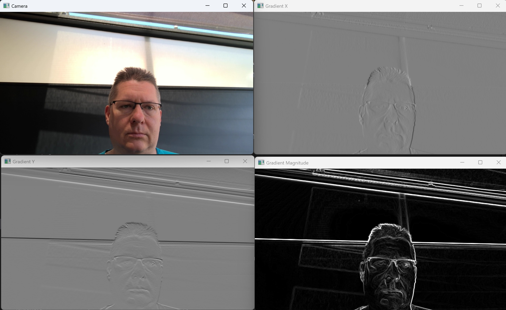

Kantendetektion mit Sobel
=========================

In diesem Praktikum wollen wir einen einfachen Kantendetektor mit dem
Sobeloperator implementieren. 

Der Code
--------

In diesem Praktikum arbeiten Sie in der Datei

.. code-block:: python
    
    kanten.py

Die Kantendetektion
-------------------

In dieser Aufgabe implementieren Sie die Funktion `processImage`

.. autofunction:: kanten.processImage

Zur Kantendetektion verwenden wir den s.g. `Sobelfilter <https://de.wikipedia.org/wiki/Sobel-Operator>`_.
Dabei wird das Bild mit zwei Masken gefaltet. Für den Gradienten in X-Richtung verwenden wir diese Maske

.. math:: 
    \begin{pmatrix}
    -1&0&1\\
    -2&0&2\\
    -1&0&2
    \end{pmatrix}

und die für den Gradienten in Y-Richtung entsprechend

.. math:: 
    \begin{pmatrix}
    -1&-2&-1\\
     0&0&0\\
     1&2&1
    \end{pmatrix}

- Da der Sobel-Operator nur auf Grauwertbildern arbeitet müssen wir das Bild jedoch zunächst in ein solches umwandeln. Verwenden Sie dazu die `cv2.cvtColor <https://www.geeksforgeeks.org/python-opencv-cv2-cvtcolor-method/>`_ Methode.

- Wandeln Sie das Bild über `np.float32 <https://numpy.org/doc/stable/user/basics.types.html>`_ in ein Float-Bild um. Normieren Sie die Grauwerte vorher indem Sie durch 255.0 teilen.

- Der Sobel-Operator selbst ist in OpenCV direkt verfügbar über die `cv2.Sobel <https://docs.opencv.org/4.x/d4/d86/group__imgproc__filter.html#gacea54f142e81b6758cb6f375ce782c8d>`_ Methode. Verwenden Sie `ksize=3` und `ddepth=cv2.CV_32F`. 

- 💡 **Überlegen Sie** durch welche Konstante Sie das Ergebnis jeweils dividieren müssen um es auf den Wertebereich von -1 bis +1 zu normieren. 

- Berechnen Sie dann die Gradientenstärke :math:`\nabla I = \sqrt{I_x^2 + I_y^2}`.

- 💡 **Überlegen Sie** wieder durch welche Konstante Sie das Ergebnis dividieren müssen um es auf den Wertebereich von 0 bis +1 zu normieren. 

.. admonition:: Lösung anzeigen
   :class: toggle

   .. code-block:: python

        def processImage(frame):
            frame_gray = cv2.cvtColor(frame, cv2.COLOR_BGR2GRAY)
            frame_gray = np.float32(frame_gray / 255.0)

            gx = cv2.Sobel(frame_gray, cv2.CV_32F, 1, 0, ksize=3) / 4.0
            gy = cv2.Sobel(frame_gray, cv2.CV_32F, 0, 1, ksize=3) / 4.0

            grad = np.sqrt(gx**2 + gy**2) / np.sqrt(2.0)

            return gx, gy, grad

Die Anzeige
-----------

In dieser Aufgabe implementieren Sie die Funktion `displayImage`

.. autofunction:: kanten.displayImage

Dazu müssen Sie die berechneten Gradientenbilder zunächst geeignet skalieren.
OpenCV zeigt Grauwertbilder mit Datentyp `np.float32` nämlich so an, das der Wert 0.0 auf
Schwarz und 1.0 auf weiß abgebildet wird. Kleinere sowie größere Werte werden jeweils abgeschnitten (gesättigt).

- 💡 **Überlegen Sie** durch welche lineare Transformation sie die Gradienterichtungsbilder vom Wertebereich zwischen -1 und +1 sinnvoll auf den von OpenCV erwartete Darstellungsbereich zwischen 0 und 1 abbilden können. 
- Zeigen Sie die Bilder dann mit `cv2.imshow <https://www.geeksforgeeks.org/python-opencv-cv2-imshow-method/>`_ in zwei eigenen Fenstern an. 
- 💡 **Überlegen Sie** Die Gradientenstärke ist bereits sinnvoll normiert und nimmt Werte zwischen 0 und 1 an. Dennoch kann es Sinn machen zur Kontrastverbesserung bei der Anzeige einen zusätzlichen Faktor einzuführen.
- Zeigen Sie das skalierte Gradientenstärkebild ebenfalls mit cv2.imshow an. 

.. admonition:: Lösung anzeigen
   :class: toggle

   .. code-block:: python

        def displayImage(gx, gy, grad):
            cv2.imshow('Gradient X', (0.5 * gx + 0.5))
            cv2.imshow('Gradient Y', (0.5 * gy + 0.5))

            cv2.imshow('Gradient Magnitude', 4.0 * grad)
Der Haupt-Loop 
--------------

In dieser Aufgabe implementieren Sie die letzte Funktion `mainLoop`

.. autofunction:: kanten.mainLoop

Folgen Sie den kommentierten TODO-Anweisungen.

Musterlösung
------------

:doc:`source`
