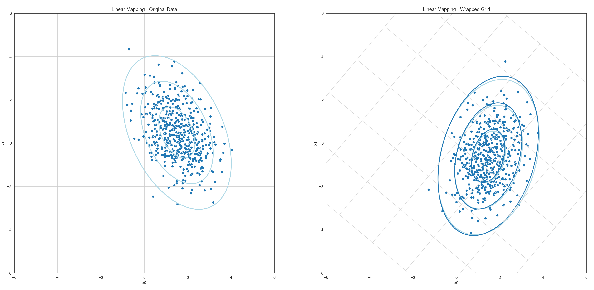

Normalverteilte Zufallsvariablen - Nichtlineare Abbildungen
===========================================================

Viele Meßgrößen von Sensoren sowie Zustände von Systeme lassen sich in
der Praxis durch normalverteile Zufallsvariablen sehr gut beschreiben. 
Dies ist eine Konsequenz auf dem `zentralen Grenzwertsatz (central limit theorem) <https://de.wikipedia.org/wiki/Zentraler_Grenzwertsatz>`_,
nachdem der Stichprobenmittelwert als Zufallsvariable näherungsweise normalverteilt ist.

Die Argumentation dabei ist, dass die Meßgröße eines Sensors als Überlagerung des eigentlichen
wahren Zustandes :math:`\textbf{x}` mit normalverteiltem Rauschen :math:`\epsilon\sim\mathcal{N}` gesehen werden kann.
Das Rauschen wird als Überlagerung (Mittelwert) unendlich vieler kleiner Störeinflüße modelliert
und ist daher aufgrund des zentralen Grenzwertsatzes normalverteilt. 

Wird der Systemzustand nun aufgrund dieser normalverteilten Meßgrößen geschätzt und zusätzlich noch von 
ebenfalls normalverteilten Störeinflüßen überlagert, so ist es plausibel anzunehmen das ebendieser Systemzustand
auch normalverteilt ist. 

Eine normalverteilte Zufallsvariable wird dabei vollständig durch Angabe ihres (ggf. mehr-dimensionalen) Mittelwertes
sowie der dazugehörigen Kovarianzmatrix beschrieben. Man sagt der Vektor von Zufallsvariablen 

.. math:: 
  \boldsymbol{x} = \begin{pmatrix}x_1\\\vdots\\x_n\end{pmatrix}

ist multivariat Normalverteilt mit Mittelwert 

.. math:: 
  \boldsymbol{\mu} = \begin{pmatrix}\mu_1\\\vdots\\\mu_n\end{pmatrix}

und Kovarianz

.. math:: 
  \Sigma = \begin{pmatrix}
              \sigma_{1}^2 & \sigma_{12}   & \dots & \sigma_{1n} \\
              \sigma_{21}   & \sigma_{22}^2 & \dots & \sigma_{2n} \\
              \vdots        & \vdots        & \ddots & \vdots \\
              \sigma_{n1}   & \sigma_{n2}   & \dots & \sigma_n^2
           \end{pmatrix}

Dabei beschreibt die Kovarianzmatrix auf ihrer Hauptdiagonale die 
Varianzen :math:`(\sigma_{1}^2,\dots,\sigma_{n}^2)` der Zufallsvariablen. Der Term 
:math:`\sigma_{ij}` entspricht dann der Kovarianz zwischen :math:`x_i` und :math:`x_j`.

Lineare Abbildungen von Zufallsvariablen
----------------------------------------

Im folgenden betrachten wir eine multivariat normalverteilte Zufallsvariable :math:`\boldsymbol{x}\in\mathbb{R}^n`, also 

.. math::
  \boldsymbol{x} \sim \mathcal{N}\left(\boldsymbol{\mu}, \Sigma\right)

sowie eine lineare Abbildung ebendieser 

.. math::
  \boldsymbol{y} = A\cdot \boldsymbol{x}

mit einer Matrix :math:`A\in\mathbb{R}^{n\times n}`  
Da die Summe normalverteilter Zufallsvariablen ebenfalls wieder normalverteilt ist gilt für lineare Abbildungen einfach

.. math::
  E[A\cdot \boldsymbol{x}] = A\cdot E[\boldsymbol{x}] = A \cdot \boldsymbol{\mu}

Für die Kovarianz von :math:`\boldsymbol{y}` finden wir entsprechend

.. math::
  Cov[A\cdot \boldsymbol{x}] = A\cdot Cov[\boldsymbol{x}]\cdot A^T = A \cdot \Sigma \cdot A^T

Lineare Abbildung - Ein Beispiel
^^^^^^^^^^^^^^^^^^^^^^^^^^^^^^^^
In dem folgenden Beispiel wurde eine multivariate Zufallsvariable mit Mittelwert
:math:`\boldsymbol{\mu} = (1.5, 0.5)` und Kovarianz 

.. math::
  \Sigma = 
  \begin{pmatrix}
   0.7 & -0.4 \\
  -0.4 & 1.4
  \end{pmatrix}

über eine lineare Abbildung :math:`\boldsymbol{y} = A\cdot\boldsymbol{x}` mit

.. math::
  A = \begin{pmatrix}
   0.76 & 0.64\\
  -0.64 & 0.76
  \end{pmatrix}

abgebildet. Für die neue Zufallsvariable ergibt sich 

.. math::
  E[A\cdot\boldsymbol{x}] = A\cdot\boldsymbol{\mu} = 
  \begin{pmatrix}
  1.47\\
  -0.58
  \end{pmatrix}

Für die Kovarianz der neuen Zufallsvariable finden wir entsprechend

.. math::
  Cov[A\cdot\boldsymbol{x}] = A\cdot\Sigma\cdot A^T = 
  \begin{pmatrix}
  0.6 & 0.28\\
  0.28 & 1.5
  \end{pmatrix}

Gezeigt sind die Kovarianzellipsen (Regionen konstanter Mahalanobis-Distanz)
sowie eine Stichprobe von 512 zufälligen Samples (Ausprägungen) der Zufallsvariable.
Im linken Teil der Grafik ist die Zufallsvariable :math:`\boldsymbol{x}` abgebildet. 

Die Samples wurden individuell mit der linearen Abbildungsmatrix in das neue Koordinatensystem
überführt und anschließend wieder der sich ergebende Mittelwert sowie die Kovarianz der Punktwolke
bestimmt. Die so entstehende Punkte sowie Ellipsen wurden hellblau in das rechte Koordinatensystem eingezeichnet.

Gleichzeitig wurde die tatsächliche Kovarianz und der tatsächliche Mittelwert als dunkelblaue Ellipsen eingezeichnet.
Beide sind nahezu deckungsgleich. Die beobachtete Abweichung ergibt sich daraus, dass für die Stichprobe lediglich 
512 zufällige Samples gezogen wurden, die Stichprobe also zu klein ist.

Nicht-Lineare Abbildungen von Zufallsvariablen
----------------------------------------------

Wird eine multivariat normalverteilte Zufallsvariable :math:`\boldsymbol{X}` durch eine nicht-lineare Funktion 
:math:`f: \mathbb{R}^n\mapsto\mathbb{R}^m` abgebildet, so ist :math:`\boldsymbol{Y} = f(\boldsymbol{X})` ebenfalls
eine Zufallsvariable. In der Regel ist :math:`\boldsymbol{Y}` jedoch nicht mehr normalverteilt. 

.. image:: nonlinear.png
  :width: 1024px
  :alt: Non-linear mapping of random variables 
  :align: center

Die Abbildung zeigt ein einfaches Beispiel. Links ist das Histogram von 400.000 Samples einer normalverteilten Zufallsvariable mit 
Mittelwert :math:`\mu=3` und Varianz :math:`\sigma^2 = 1` gezeigt. Wird die Zufallsvariable durch 
:math:`f(x) = x^2` auf eine neue Zufallsvariable :math:`\boldsymbol{Y} = f(\boldsymbol{X})` abgebildet, 
so ist diese offensichtlich nicht mehr normalverteilt (siehe dazu das rechte Histogram der sich ergebenden Verteilung).

Um dennoch eine Näherung für die Verteilung von :math:`\boldsymbol{Y}` zu erhalten, kann die nicht-lineare Abbildung 
:math:`f(\boldsymbol{X})` im Punkt des Erwartungswerts :math:`\boldsymbol{\mu}_X = \mathbb{E}[\boldsymbol{X}]` 
durch eine lineare Funktion approximiert werden. Dies geschieht durch eine Taylor-Entwicklung erster Ordnung:

.. math::
  f(\boldsymbol{X}) \approx f(\boldsymbol{\mu}_X) + J_f(\boldsymbol{\mu}_X) (\boldsymbol{X} - \boldsymbol{\mu}_X),

wobei :math:`J_f(\boldsymbol{\mu}_X)` die Jacobi-Matrix von :math:`f` an der Stelle :math:`\boldsymbol{\mu}_X` ist.

Da die Linearkombination einer normalverteilten Zufallsvariablen wieder normalverteilt ist, lässt sich auf Basis dieser Approximation 
eine multivariate Normalverteilung für :math:`\boldsymbol{Y}` angeben:

- Der approximierte Erwartungswert ergibt sich zu

  .. math::
    \mathbb{E}[\boldsymbol{Y}] \approx f(\boldsymbol{\mu}_X),

- und die approximierte Kovarianzmatrix zu

  .. math::
    \Sigma_Y \approx J_f(\boldsymbol{\mu}_X) \, \Sigma_X \, J_f(\boldsymbol{\mu}_X)^\top,

wobei :math:`\Sigma_X` die Kovarianzmatrix von :math:`\boldsymbol{X}` ist.

Diese Methode entspricht einer Taylor-Entwicklung erster Ordnung und wird 
typischerweise im Extended Kalman Filter (EKF) verwendet. 
Für genauere Approximationen existieren alternative Methoden wie die 
`Unscented Transform <https://en.wikipedia.org/wiki/Unscented_transform>`_, 
bei der deterministisch gewählte Sigma-Punkte durch die nichtlineare Abbildung propagiert werden.

Die Jacobi-Matrix
^^^^^^^^^^^^^^^^^

Die Jacobi-Matrix ist eine Matrix, die alle ersten partiellen Ableitungen einer vektorwertigen Funktion enthält. 
Betrachtet man eine Funktion :math:`f: \mathbb{R}^n \rightarrow \mathbb{R}^m`, so ergibt sich die Jacobi-Matrix 
:math:`J_f(\boldsymbol{x})` als eine :math:`m \times n`-Matrix:

.. math::
  J_f(\boldsymbol{x}) = 
  \begin{bmatrix}
  \frac{\partial f_1}{\partial x_1} & \cdots & \frac{\partial f_1}{\partial x_n} \\
  \vdots & \ddots & \vdots \\
  \frac{\partial f_m}{\partial x_1} & \cdots & \frac{\partial f_m}{\partial x_n}
  \end{bmatrix}

Jede Zeile enthält dabei die partiellen Ableitungen einer Komponente von :math:`f`. Mit anderen Worten: 
Die Jacobi-Matrix beschreibt, wie sich kleine Änderungen in :math:`\boldsymbol{X}` auf jede Komponente von :math:`f(\boldsymbol{X})` auswirken. 
Sie ist die natürliche Verallgemeinerung der Ableitung aus der eindimensionalen Analysis auf mehrdimensionale Vektorfunktionen.

In unserem Kontext wird die Jacobi-Matrix verwendet, um eine nichtlineare Funktion im Punkt :math:`\boldsymbol{\mu}_X` 
durch eine lineare Abbildung zu approximieren.

Die Jacobi-Matrix - Ein Beispiel
^^^^^^^^^^^^^^^^^^^^^^^^^^^^^^^^

Es sei :math:`(r, \alpha)` ein zwei-dimensionaler Punkt in 
`Polarkoordinaten <https://de.wikipedia.org/wiki/Polarkoordinaten>`_, also dargestellt über 
seinen Abstand zum Ursprung :math:`r` sowie den Winkel zum x-Achse :math:`\alpha`.

Die Abbildung in gewohnte `kartesische Koordinaten <https://de.wikipedia.org/wiki/Kartesisches_Koordinatensystem>`_ 
läßt sich über die nicht-lineare Funktion

.. math::
    f(r, \alpha) = 
    \begin{pmatrix}
      r\cdot \cos(\alpha)\\
      r\cdot \sin(\alpha)
    \end{pmatrix}

darstellen. Für die Jacobi-Matrix finden wir dann

.. math::
    J_f(r, \alpha) = 
    \begin{bmatrix}
      \frac{\partial}{\partial r}(r \cos(\alpha)) & \frac{\partial}{\partial \alpha}(r \cos(\alpha)) \\
      \frac{\partial}{\partial r}(r \sin(\alpha)) & \frac{\partial}{\partial \alpha}(r \sin(\alpha))
    \end{bmatrix}
    =
    \begin{bmatrix}
      \cos(\alpha) & -r \sin(\alpha) \\
      \sin(\alpha) & r \cos(\alpha)
    \end{bmatrix}

Diese Matrix beschreibt die lokale lineare Approximation der Koordinatentransformation am Punkt :math:`(r, \alpha)`. 
Sie zeigt insbesondere, wie Änderungen in Radius und Winkel sich auf die kartesischen Koordinaten auswirken. 

Kennt man den Erwartungswert :math:`\boldsymbol{\mu}_{(r,\alpha)}` sowie die Kovarianzmatrix :math:`\Sigma_{(r,\alpha)}` 
der ursprünglichen (in Polarkoordinaten beschriebenen) Zufallsvariablen, so lässt sich durch Einsetzen der Jacobi-Matrix 
in die Approximation

.. math::
    \Sigma_{(x,y)} \approx J_f(\boldsymbol{\mu}_{(r,\alpha)}) \, \Sigma_{(r,\alpha)} \, J_f(\boldsymbol{\mu}_{(r,\alpha)})^\top

eine Näherung der Kovarianzmatrix im kartesischen Raum berechnen.

.. image:: polar.png
  :width: 1024px
  :alt: Non-Linear Mapping of Random Variable
  :align: center

Der obige Plot zeigt ein Beispiel für eine solche Transformation. Links ist die normalverteilte Zufallsvariable 
:math:`\boldsymbol{X}` zu sehen. Die Zufallsvariable weißt in :math:`r`-Richtung (horizontal) nur eine geringe Unsicherheit
auf. Das entspricht einer hohen Genauigkeit was Entfernungsschätzungen angeht. In :math:`\alpha`-Richtung (vertikal) ist die Unsicherheit 
deutlich größer, die Winkelgenauigkeit ist also deutlich schlechter. Das entspricht dem typischen Unsicherheitsprofil eines Radars. 

Rechts ist die nicht-lineare Transformation dieser Zufallsvariable in den kartesischen Raum zu sehen. Solange
die Winkelunsicherheit nicht zu groß ist kann die entstehende Verteilung hinreichend gut durch eine Normalverteilung beschrieben werden. 

Was passiert nun wenn die Winkelunsicherheit zu groß wird?
^^^^^^^^^^^^^^^^^^^^^^^^^^^^^^^^^^^^^^^^^^^^^^^^^^^^^^^^^^

.. image:: polar2.png
  :width: 1024px
  :alt: Non-Linear Mapping of Random Variable
  :align: center

Im  obigen Plot wurde die Winkelunsicherheit deutlich erhöht. Die möglichen Meßwerte (die einzelnen Punkte der Punktwolke)
decken nun einen so großen Bereich ab, dass die Transformation in kartesische Koordinate nicht mehr sinnvoll 
durch eine Normalverteilung beschrieben werden kann. Dies zeigt sich auch daran das die durch 
Linearisierung geschätzten Parameter (Mittelwert und Kovarianz, gezeichnet in Dunkelblau) deutlich von dem tatsächlichen 
Mittelwert und der tatsächlchen Kovarianz der transformierten Punkte (gezeichnet in Hellblau) abweichen. 

**Aufgabe 1**: Lineare Abbildung
--------------------------------

In dieser Aufgabe arbeiten Sie in der Datei

.. code-block:: bash
  
  nonlinearmapping/linear.py

Implementieren Sie die Methode :py:func:`linear.map_samples`. Folgen Sie den Anweisungen im Code.

.. autofunction:: linear.map_samples

.. admonition:: Lösung anzeigen
   :class: toggle

   .. code-block:: python

       def map_samples(samples, alpha):
          # TODO: Calculate Matrix A
          s, c = np.sin(alpha), np.cos(alpha)

          A = np.array([[ c, s], 
                        [-s, c]])
          
          # TODO: Map the samples and calculate the exact mean and covariance of the Y
          mu  = np.array([1.5, 0.5])
          cov = np.array([[0.7, -0.4],[-0.4, 1.4]])
          
          mapped_samples = A @ samples
          mapped_mu = A @ mu.reshape(-1,1)
          mapped_cov = A @ cov @ A.T

          # TODO: Return your mapped samples, the mapped mean and the mapped covariance
          return mapped_samples, mapped_mu, mapped_cov

Starten Sie dann das Program. Wenn Sie alles richig gemacht haben sehen Sie einen animierten Plot
ähnlich zu dem oben gezeigten Bild. Sie sollten sehen das die aus der Punktwolke geschätzten 
Kovarianzellipsen (hellblau) stets nahezu identisch sind mit denen von ihnen berechneten sind. 

**Aufgabe 2**: Polarkoordinaten nach Kartesisch
-----------------------------------------------

In dieser Aufgabe arbeiten Sie in der Datei

.. code-block:: bash
  
  nonlinearmapping/polar.py

Implementieren Sie die Methode :py:func:`polar.map_samples`. Folgen Sie den Anweisungen im Code.

.. autofunction:: polar.map_samples

.. admonition:: Lösung anzeigen
   :class: toggle

   .. code-block:: python

       def map_samples(samples, alpha):
          # TODO: Map all samples from polar to cartesian coordinates  
          r, a = samples[0, :], samples[1, :]

          mapped_samples = np.zeros_like(samples)
          mapped_samples[0, :] = r * np.cos(a)
          mapped_samples[1, :] = r * np.sin(a)

          # TODO: Calculate Jacobian 
          J = np.array([[np.cos(alpha), -radius*np.sin(alpha)],
                        [np.sin(alpha),  radius*np.cos(alpha)]])
          
          # TODO: Calculate mean and covariance of Y after linearization
          mapped_mu = np.array([radius * np.cos(alpha), radius * np.sin(alpha)])
          mapped_cov = J @ cov @ J.T

          # TODO: Return your mapped samples, the mapped mean and the mapped covariance
          return mapped_samples, mapped_mu, mapped_cov

Starten Sie dann das Program. Wenn Sie alles richig gemacht haben sehen Sie einen animierten Plot
ähnlich zu dem oben gezeigten Bild. Sie sollten sehen das die aus der Punktwolke geschätzten 
Kovarianzellipsen (hellblau) stets nahezu identisch sind mit denen von ihnen berechneten sind.

**Aufgabe 3**: Polarkoordinaten nach Kartesisch - Teil 2
--------------------------------------------------------

Erhöhen Sie im Skript den Wert der Variable 

.. code-block:: python

  STD_ALPHA = 5 # Standard deviation of angular values (degrees)

auf z.B. 25° und schauen Sie was passiert.

Praxisbeispiel für nichtlineare Transformation: Sauerstoffsättigung im Blut
---------------------------------------------------------------------------

Medizinischer Hintergrund
-------------------------

Die Sauerstoffsättigung des Hämoglobins im menschlichen Blut ist eine wichtige medizinische Messgröße. 
Sie beschreibt, wie viel Prozent des verfügbaren Hämoglobins mit Sauerstoff beladen ist – ein zentraler Indikator 
für die Versorgung des Körpers mit Sauerstoff.

Direkt gemessen wird in der Regel jedoch nicht die Sättigung selbst, sondern der **Sauerstoffpartialdruck** 
(:math:`p`) im arteriellen Blut, beispielsweise mit einem Pulsoxymeter oder einer Blutgasanalyse. 
Zwischen dem Partialdruck und der Sättigung besteht ein **nichtlinearer** Zusammenhang, 
der durch die sogenannte **Hill-Gleichung** beschrieben werden kann.

Die Hill-Gleichung
------------------

Die Sauerstoffsättigung :math:`S` in Abhängigkeit vom Sauerstoffpartialdruck :math:`p` lässt sich durch die folgende Funktion annähern:

.. math::
   S(p) = \frac{p^n}{p^n + K^n}

Dabei sind:
- :math:`p` der Sauerstoffpartialdruck in mmHg,
- :math:`n` der sogenannte Hill-Koeffizient (beschreibt die Kooperativität der Sauerstoffbindung),
- :math:`K` der Partialdruck, bei dem 50 % des Hämoglobins gesättigt sind.

Typische Werte für menschliches Hämoglobin sind :math:`n = 2{,}7` und :math:`K = 26` mmHg.

Ziel dieser Aufgabe ist es, zu untersuchen, wie sich Unsicherheiten bei der Messung des Sauerstoffpartialdrucks 
auf die Verteilung der Sauerstoffsättigung auswirken – insbesondere bei Verwendung einer linearen Approximation 
mittels Taylor-Entwicklung erster Ordnung.

Das Experiment 
--------------
Ein typisches Experiment in diesem Bereich sieht so aus:

#. Gegeben ist eine normalverteilte Zufallsvariable für den Sauerstoffpartialdruck:

   .. math::
      p \sim \mathcal{N}(\mu_p = 40\,\text{mmHg}, \sigma_p^2 = 25\,\text{mmHg}^2)

   Bestimmen Sie den Erwartungswert :math:`\mu_S` und die Varianz :math:`\sigma_S^2` der Sauerstoffsättigung :math:`S(p)` 
   unter Verwendung einer linearen Approximation im Punkt :math:`\mu_p`.

#. Leiten Sie dazu die erste Ableitung der Funktion :math:`S(p)` nach :math:`p` her und verwenden Sie diese zur Approximation 
   mittels Taylor-Entwicklung erster Ordnung.

#. Führen Sie eine Monte-Carlo-Simulation mit mindestens 10.000 Zufallswerten :math:`p_i \sim \mathcal{N}(\mu_p, \sigma_p^2)` durch.
   Transformieren Sie jeden Wert mit :math:`S(p_i)` und schätzen Sie den empirischen Mittelwert und die Varianz der resultierenden Verteilung.

#. Vergleichen Sie die Ergebnisse der Simulation mit den Werten aus der linearen Approximation.

#. Wiederholen Sie die Schritte 1–4 für folgende alternative Mittelwerte:
   - :math:`\mu_p = 20` mmHg
   - :math:`\mu_p = 80` mmHg

#. Diskutieren Sie Ihre Beobachtungen:
   - Wann funktioniert die lineare Approximation gut?
   - In welchen Fällen weicht sie stark vom Simulationsergebnis ab?
   - Was ist der Einfluss der Lage von :math:`\mu_p` relativ zur Sättigungskurve?

Wir wollen dieses Experiment im folgenden in Python mit NumPy durchführen.    

**Aufgabe 4**: Sauerstoffsättigung bestimmen
--------------------------------------------

In dieser Aufgabe arbeiten Sie in der Datei

.. code-block:: bash
  
  nonlinearmapping/oxygen.py

Implementieren Sie die Methode :py:func:`oxygen.map_samples`. Folgen Sie den Anweisungen im Code.

.. autofunction:: oxygen.map_samples

.. admonition:: Lösung anzeigen
   :class: toggle

   .. code-block:: python

       def map_samples(samples):
          N, K = 2.7, 26
    
          # TODO: Apply the Hill function to each sample to get saturation values
          mapped_samples = np.power(samples, N) / (np.power(samples, N) + np.power(K, N))

          # TODO: Use np.mean and np.var to compute mean and variance of the original input samples
          mu = np.mean(samples)
          V = np.var(samples)
          
          # TODO: Compute the derivative (Jacobian) of the Hill function at the mean
          J = N * np.power(K, N) * np.power(mu, N-1) / ((np.power(mu, N) + np.power(K, N))**2)

          # TODO: Compute the transformed mean using the Hill function
          mapped_mu = np.power(mu, N) / (np.power(mu,N) + np.power(K, N))
          
          # TODO: Approximate the transformed variance via linear error propagation
          mapped_var = J * V * J

          # TODO: Return the mapped samples, the mapped mean and the mapped variance
          return mapped_samples, mapped_mu, mapped_var

**Aufgabe 5**: Experimentieren mit den Werten
---------------------------------------------

Experimentieren Sie im Skript mit verschiedenen Werten für den Mittelwert :math:`\mu_p` und die Standardabweichung :math:`\sigma_p`
   - :math:`\mu_p = 20` mmHg
   - :math:`\mu_p = 80` mmHg
   - :math:`\sigma_p = 2.5` mmHg
   - :math:`\sigma_p = 10` mmHg

Diskutieren Sie dann Ihre Beobachtungen:
   - Wann funktioniert die lineare Approximation gut?
   - In welchen Fällen weicht sie stark vom Simulationsergebnis ab?
   - Was ist der Einfluss der Lage von :math:`\mu_p` relativ zur Sättigungskurve?

Musterlösung
------------
- :doc:`linearsource`
- :doc:`polarsource`
- :doc:`oxygensource`
